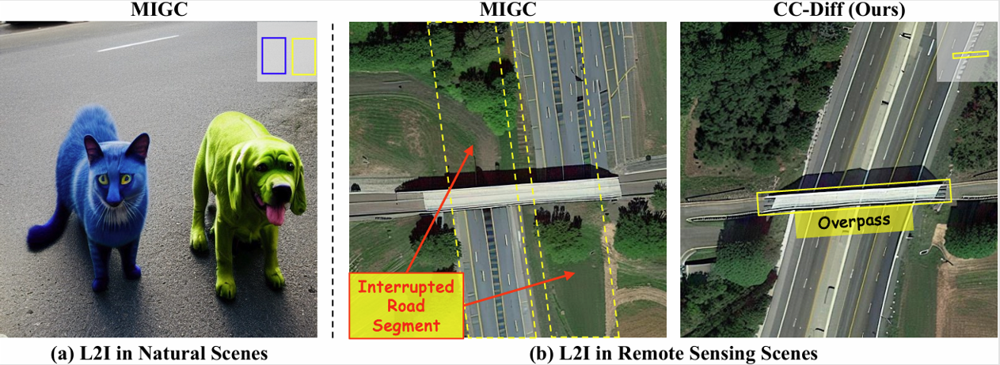
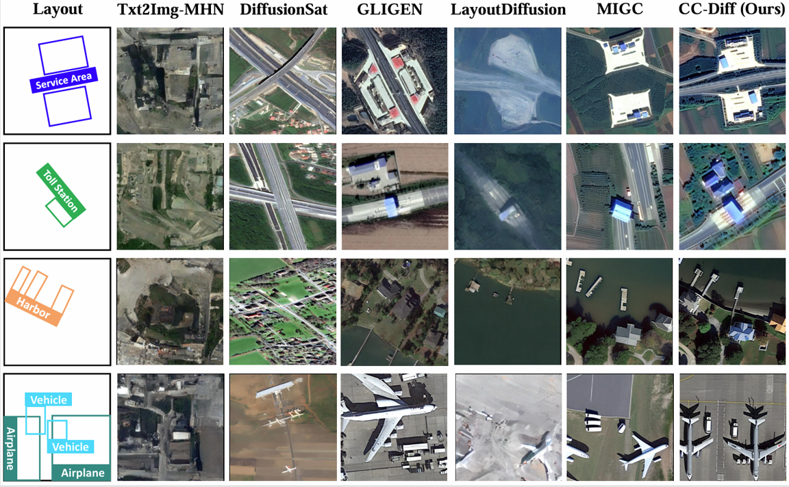

# CC-Diff: Enhancing Contextual Coherence in Remote Sensing Image Synthesis


## Installation

### Conda environment setup
```
conda create -n CC-Diff python=3.9 -y
conda activate CC-Diff
pip install -r requirement.txt
```

## Checkpoint
Download the [DIOR_checkpoint](https://drive.google.com/drive/folders/1_gdFS-jN4z-RcvT5_IDcPq4_1JJK6FOA?usp=sharing) or [DOTA_checkpoint](https://drive.google.com/drive/folders/1kKhpMUhBOatccbsflubOIm1_qeepcEla?usp=sharing)

## Inference

```
python infer_dior.py
```

## Data preparation

This is an example:
```
DIOR
├── train
│   ├── 00003.jpg
|   ├── ...
|   ├── metadata.jsonl
├── val
|   ├── 00011.jpg
|   ├── ...
|   ├── metadata.jsonl
├── results
│   ├── ...
├── dior_emb.pt
```
Data processing scripts are in ```data_tools```.

## Training
```
./dist_train.sh
```

## Visualizations


## Acknowledgements
Our work is based on [stable diffusion](https://github.com/Stability-AI/StableDiffusion), [diffusers](https://github.com/huggingface/diffusers), [CLIP](https://github.com/openai/CLIP), We appreciate their outstanding contributions.