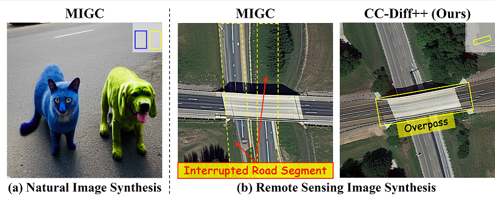
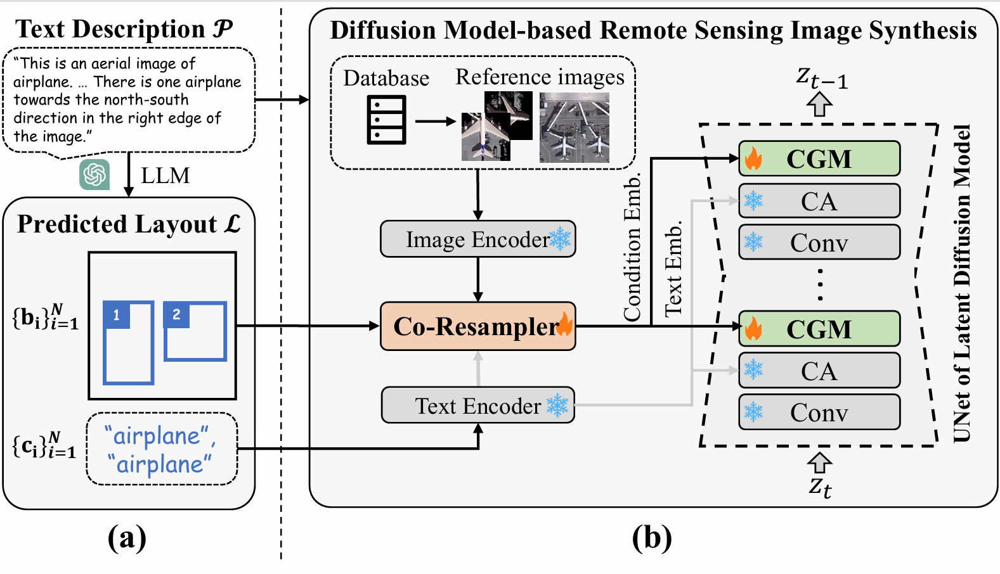
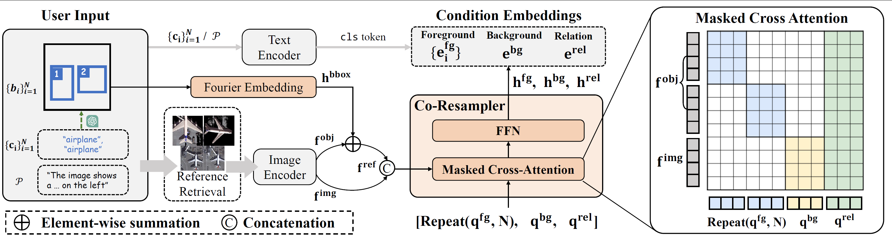
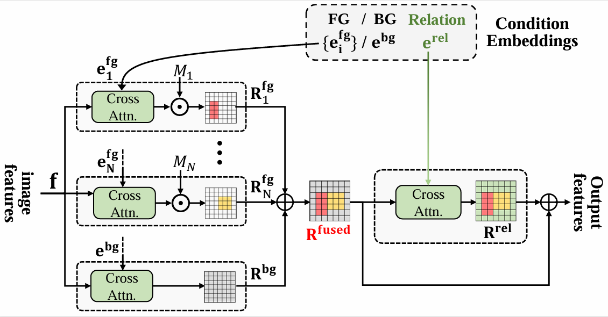
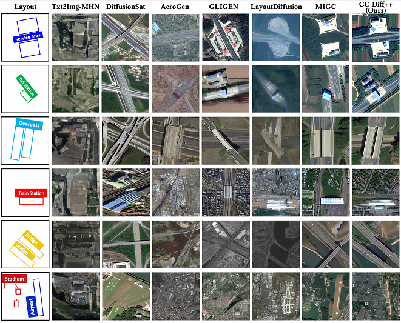
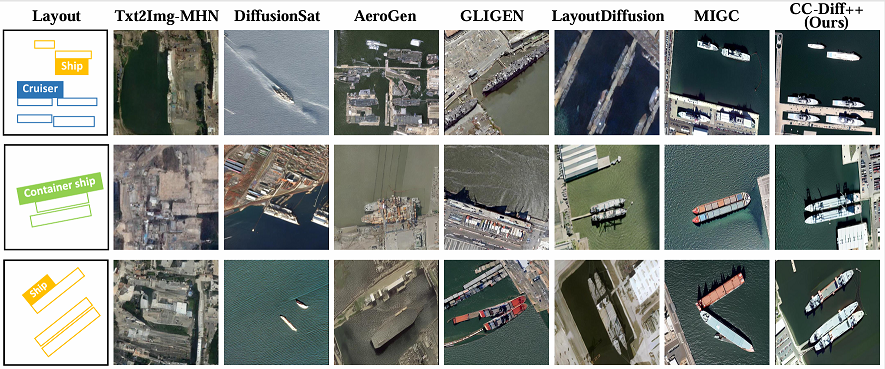

<div align="center">
<h1>CC-Diff: Enhancing Contextual Coherence in Remote Sensing Image Synthesis</h1>
</div>

## 🔥News
- 2025-09-25: CC-Diff++ has been accepted by TGRS[10.1109/TGRS.2025.3616376](https://ieeexplore.ieee.org/document/11187367)
- 2024-12-03: Publish initial code.
- 2024-12-12: Arxiv is avaliable [(arxiv: 2412.08464)](https://arxiv.org/abs/2412.08464).
## Abstract
<div style="text-align:justify">
Generating visually realistic remote sensing (RS) images requires maintaining semantic coherence between objects and their surrounding environment. However, existing image synthesis methods prioritize foreground controllability while oversimplifying backgrounds into plain or generic textures. This oversight neglects the crucial interaction between foreground and background elements, resulting in semantic inconsistencies in RS scenarios. To address this challenge, we propose CC-Diff++, a Diffusion Model-based approach for spatially controllable RS image synthesis with enhanced Context Coherence. To capture spatial interdependence, we propose a novel module named Co-Resampler, which employs an advanced masked attention mechanism to jointly extract features from both the foreground and background while modeling their mutual relationships. Furthermore, we introduce a text-to-layout prediction module powered by Large Language Models (LLMs) and a reference image retrieval mechanism for providing rich textural guidance, which work together to enable CC-Diff++ to generate outputs that are both more diverse and more realistic.Extensive experiments demonstrate that CC-Diff++ outperforms state-of-the-art methods in visual fidelity, semantic accuracy, and positional precision on multiple RS datasets. CC-Diff++ also shows strong trainability, improving detection accuracy by 2.04 mAP on DOTA and 11.81 mAP on the HRSC dataset.
</div>

## Overview
* **CC-Diff++ can generate RS images with enhanced context coherence.**
<p align="center">
  
</p>

* **An overview of CC-Diff++'s pipeline.**
<p align="center">
  
</p>

* **Detailed structure of Co-Resampler and Conditional Generation Module.**
<p align="center">
  
</p>
<p align="center">
  
</p>


* **Gallery**

**DIOR-RSVG**
<p align="center">
  
</p>

**DOTA**
<p align="center">
  
</p>

**HRSC**
<p align="center">
  
</p>

<!-- ...existing code... -->
## Main Results
### **Quantitative comparison of results on RS datasets DIOR-RSVG, DOTA and HRSC.**
<table style="text-align: center; width: 100%;">
  <thead>
    <tr>
      <th rowspan="2" style="text-align: center;">Method</th>
      <th colspan="5" style="text-align: center;">DIOR-RSVG</th>
      <th colspan="5" style="text-align: center;">DOTA</th>
      <th colspan="5" style="text-align: center;">HRSC</th>
    </tr>
    <tr>
      <th style="text-align: center;">CLIP-L &uarr;</th>
      <th style="text-align: center;">CLIP-G &uarr;</th>
      <th style="text-align: center;">FID &darr;</th>
      <th style="text-align: center;">mAP<sub>50</sub></th>
      <th style="text-align: center;">mAP<sub>50:95</sub></th>
      <th style="text-align: center;">CLIP-L &uarr;</th>
      <th style="text-align: center;">CLIP-G &uarr;</th>
      <th style="text-align: center;">FID &darr;</th>
      <th style="text-align: center;">mAP<sub>50</sub></th>
      <th style="text-align: center;">mAP<sub>50:95</sub></th>
      <th style="text-align: center;">CLIP-L &uarr;</th>
      <th style="text-align: center;">CLIP-G &uarr;</th>
      <th style="text-align: center;">FID &darr;</th>
      <th style="text-align: center;">mAP<sub>50</sub></th>
      <th style="text-align: center;">mAP<sub>50:95</sub></th>
    </tr>
  </thead>
  <tbody>
    <tr>
      <td>Txt2Img-MHN</td>
      <td>18.91</td><td>23.46</td><td>123.84</td><td>0.43</td><td>0.16</td>
      <td>19.58</td><td>25.99</td><td>137.76</td><td>0.07</td><td>0.02</td>
      <td>17.22</td><td>21.82</td><td>91.27</td><td>0.10</td><td>0.02</td>
    </tr>
    <tr>
      <td>DiffusionSat</td>
      <td>19.84</td><td><b>32.68</b></td><td>78.16</td><td>2.87</td><td>0.84</td>
      <td>19.78</td><td><b>31.61</b></td><td>65.19</td><td>0.22</td><td>0.05</td>
      <td>17.36</td><td>30.09</td><td>83.53</td><td>0.13</td><td>0.01</td>
    </tr>
    <tr>
      <td>GLIGEN</td>
      <td>20.55</td><td>32.22</td><td>73.02</td><td>7.90<sup>&dagger;</sup></td><td>2.74<sup>&dagger;</sup></td>
      <td>20.72</td><td>29.98</td><td>61.05</td><td>0.95<sup>&dagger;</sup></td><td>0.28<sup>&dagger;</sup></td>
      <td>19.48</td><td>30.51</td><td>68.12</td><td>1.89<sup>&dagger;</sup></td><td>0.56<sup>&dagger;</sup></td>
    </tr>
    <tr>
      <td>AeroGen</td>
      <td>20.28</td><td>30.75</td><td>74.90</td><td>43.16</td><td>27.97</td>
      <td>21.55</td><td>26.13</td><td>55.02</td><td>41.88</td><td>26.37</td>
      <td>18.96</td><td>28.24</td><td>62.40</td><td>9.56</td><td>4.37</td>
    </tr>
    <tr>
      <td>LayoutDiffusion</td>
      <td>19.31</td><td>30.65</td><td>79.03</td><td>41.22</td><td>24.23</td>
      <td>20.49</td><td>27.67</td><td>64.77</td><td>42.70</td><td>22.66</td>
      <td>19.48</td><td>29.39</td><td>73.95</td><td>11.44</td><td>3.84</td>
    </tr>
    <tr>
      <td>MIGC</td>
      <td>21.59</td><td>32.36</td><td>79.93</td><td>46.92</td><td>30.10</td>
      <td>22.21</td><td>30.96</td><td>63.95</td><td>57.06</td><td>33.66</td>
      <td>21.69</td><td>30.91</td><td>66.13</td><td>27.05</td><td>16.93</td>
    </tr>
    <tr>
      <td>CC-Diff</td>
      <td>21.82</td><td>32.36</td><td>70.68</td><td>56.59</td><td>39.97</td>
      <td>22.60</td><td>30.92</td><td>47.72</td><td>57.72</td><td>34.04</td>
      <td>21.27</td><td>30.48</td><td>64.96</td><td>28.91</td><td>17.31</td>
    </tr>
    <tr>
      <td><b>CC-Diff++</b></td>
      <td><b>21.94</b></td><td>32.52</td><td><b>65.86</b></td><td><b>56.94</b></td><td><b>39.99</b></td>
      <td><b>22.66</b></td><td>30.93</td><td><b>47.02</b></td><td><b>58.59</b></td><td><b>35.66</b></td>
      <td><b>23.21</b></td><td><b>30.96</b></td><td><b>61.52</b></td><td><b>30.48</b></td><td><b>17.37</b></td>
    </tr>
  </tbody>
</table>

### **Trainability comparison on DIOR-RSVG, DOTA and HRSC.**
<table style="text-align: center; width: 100%;">
  <thead>
    <tr>
      <th rowspan="2" style="text-align: center;">Method</th>
      <th colspan="3" style="text-align: center;">DIOR-RSVG</th>
      <th colspan="3" style="text-align: center;">DOTA</th>
      <th colspan="3" style="text-align: center;">HRSC</th>
    </tr>
    <tr>
      <th style="text-align: center;">mAP</th>
      <th style="text-align: center;">mAP<sub>50</sub></th>
      <th style="text-align: center;">mAP<sub>75</sub></th>
      <th style="text-align: center;">mAP</th>
      <th style="text-align: center;">mAP<sub>50</sub></th>
      <th style="text-align: center;">mAP<sub>75</sub></th>
      <th style="text-align: center;">mAP</th>
      <th style="text-align: center;">mAP<sub>50</sub></th>
      <th style="text-align: center;">mAP<sub>75</sub></th>
    </tr>
  </thead>
  <tbody>
    <tr>
      <td>Baseline</td>
      <td>50.17</td><td>75.84</td><td>54.38</td>
      <td>35.53</td><td>62.10</td><td>35.83</td>
      <td>34.88</td><td>51.45</td><td>40.90</td>
    </tr>
    <tr>
      <td>Txt2Img-MHN</td>
      <td>50.12</td><td>75.87</td><td>54.74</td>
      <td>35.91</td><td>62.53</td><td>36.43</td>
      <td>33.45</td><td>49.65</td><td>38.67</td>
    </tr>
    <tr>
      <td>DiffusionSat</td>
      <td>49.95</td><td>75.59</td><td>55.26</td>
      <td>36.15</td><td>62.50</td><td>36.76</td>
      <td>29.67</td><td>45.62</td><td>33.51</td>
    </tr>
    <tr>
      <td>AeroGen</td>
      <td>51.39</td><td>76.85</td><td>56.75</td>
      <td>36.65</td><td>63.15</td><td>36.96</td>
      <td>44.43</td><td>60.38</td><td>50.60</td>
    </tr>
    <tr>
      <td>LayoutDiffusion</td>
      <td>51.96</td><td>77.31</td><td>56.82</td>
      <td>35.15</td><td>61.54</td><td>35.18</td>
      <td>43.74</td><td>60.27</td><td>51.34</td>
    </tr>
    <tr>
      <td>MIGC</td>
      <td>51.87</td><td>76.65</td><td>57.20</td>
      <td>35.93</td><td>62.36</td><td>36.32</td>
      <td>42.18</td><td>60.01</td><td>49.44</td>
    </tr>
    <tr>
      <td>CC-Diff</td>
      <td>52.18</td><td>77.39</td><td>57.59</td>
      <td>37.36</td><td>63.18</td><td><b>38.55</b></td>
      <td>42.15</td><td>61.15</td><td>50.74</td>
    </tr>
    <tr>
      <td><b>CC-Diff++</b></td>
      <td><b>52.62</b></td><td><b>77.51</b></td><td><b>58.09</b></td>
      <td><b>37.57</b></td><td><b>63.18</b></td><td>38.05</td>
      <td><b>46.69</b></td><td><b>66.58</b></td><td><b>55.73</b></td>
    </tr>
  </tbody>
</table>
<!-- ...existing code... -->


## Getting Started
### 1. Installation

To get started, first clone the CC-Diff repository:
```bash
git clone https://github.com/AZZMM/CC-Diff.git
cd CC-Diff
```

Environment setup:
```bash
conda create -n CC-Diff python=3.9 -y
conda activate CC-Diff
pip install -r requirement.txt
```

### 2. Data Preparation

**2.1 Dataset processing**

This is an example:
```
DIOR
├── train
│   ├── 00003.jpg
|   ├── ...
|   ├── metadata.jsonl
├── val
|   ├── 00011.jpg
|   ├── ...
|   ├── metadata.jsonl
├── results
│   ├── ...
├── dior_emb.pt
```
Dataset processing scripts are in ```data_tools```, for details see [data_process.md](./data_tools/data_process.md).

**2.2 Checkpoint**

Download the [DIOR_checkpoint](https://drive.google.com/drive/folders/1_gdFS-jN4z-RcvT5_IDcPq4_1JJK6FOA?usp=sharing) or [DOTA_checkpoint](https://drive.google.com/drive/folders/1kKhpMUhBOatccbsflubOIm1_qeepcEla?usp=sharing).


### 3. Model Inference and Training

Controllable RS image generation:
```bash
python infer_dior.py
```
Train CC-Diff model:
```bash
./dist_train.sh
```

### 4. CC-Diff++

We include the implementation of the enhanced version: **CC-Diff++** in ```ccdiff_pp``` folder.

Training:
Just replace the script ```train_dior.py``` in ```./dist_train.sh``` with ```train_dior_pp.py``` to train the CC-Diff++ model.

Inference:
```bash
accelerate launch 
  --main_process_port=29500,
  --num_processes=8
  infer_dior_pp.py
```

### 5.synthetic images
We here publish the synthetic images used in the trainability experiments for every dataset, enabling exact reproduction of our results.

DIOR-RSVG: [link](https://pan.baidu.com/s/1nBad0IK8BSM_pUBwdm5Z7g?pwd=ccdp), Password: ccdp

DOTA: [link](https://pan.baidu.com/s/1P5vshdqUHFPOxH4JNveMbQ?pwd=ccdp), Password: ccdp

HRSC: [link](https://pan.baidu.com/s/1sBL07plL8bvWrvyzUS-YSg?pwd=ccdp), Password: ccdp


## Acknowledgements
Our work is based on [stable diffusion](https://github.com/Stability-AI/StableDiffusion), [diffusers](https://github.com/huggingface/diffusers), [CLIP](https://github.com/openai/CLIP), We appreciate their outstanding contributions.

## 📄 BibTex
```
@ARTICLE{11187367,
  author={Zhang, Mu and Liu, Yunfan and Liu, Yue and Zhao, Yuzhong and Ye, Qixiang},
  journal={IEEE Transactions on Geoscience and Remote Sensing}, 
  title={CC-Diff++: Spatially Controllable Text-to-Image Synthesis for Remote Sensing With Enhanced Contextual Coherence}, 
  year={2025},
  volume={63},
  number={},
  pages={1-16},
  keywords={Semantics;Image synthesis;Coherence;Layout;Diffusion models;Remote sensing;Feature extraction;Visualization;Roads;Training;Diffusion model;generative model;image synthesis;layout-to-image (L2I) generation;text-to-image (T2I) generation},
  doi={10.1109/TGRS.2025.3616376}}

```