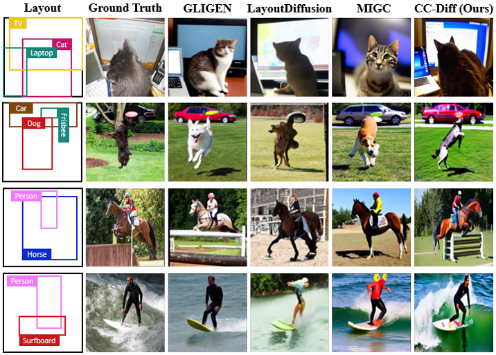

<div align="center">
<h1>CC-Diff: Enhancing Contextual Coherence in Remote Sensing Image Synthesis</h1>
</div>

## 🔥News
- 2024-12-03: Publish initial code (arxiv coming soon).
## Abstract
<div style="text-align:justify">
Accurately depicting real-world landscapes in remote sensing (RS) images requires precise alignment between objects and their environment. However, most existing synthesis methods for natural images prioritize foreground control, often reducing the background to plain textures. This neglects the interaction between foreground and background, which can lead to incoherence in RS scenarios. In this paper, we introduce CC-Diff, a **Diff**usion Model-based approach for RS image generation with enhanced **C**ontext **C**oherence. To capture spatial interdependence, we propose a sequential pipeline where background generation is conditioned on synthesized foreground instances. Distinct learnable queries are also employed to model both the complex background texture and its semantic relation to the foreground. Extensive experiments demonstrate that CC-Diff outperforms state-of-the-art methods in visual fidelity, semantic accuracy, and positional precision, excelling in both RS and natural image domains. CC-Diff also shows strong trainability, improving detection accuracy by 2.04 mAP on DOTA and 2.25 mAP on the COCO benchmark.
</div>

## Overview
* **CC-Diff can generate RS images with enhanced context coherence.**
<p align="center">
  
</p>

* **An overview of CC-Diff's pipeline.**
<p align="center">
  
</p>

* **Detailed structure of Dual Re-sampler and Conditional Generation Module.**
<div align="center">
    <table>
        <tr>
            <td align="center">
                
            </td>
            <td align="center">
                
            </td>
        </tr>
    </table>
</div>

* **Gallery**
<p align="center">
  
</p>
<p align="center">
  
</p>

## Main Results
### **Quantitative comparison of results on RS datasets DIOR-RSVG and DOTA.**
<table style="text-align: center; width: 80%;">
  <thead>
    <tr>
      <th colspan="6" style="text-align: center;">DIOR-RSVG</th>
      <th></th>
      <th colspan="6" style="text-align: center;">DOTA</th>
    </tr>
    <tr>
      <th style="text-align: center;">Method</th>
      <th colspan="2" style="text-align: center;">CLIPScore &uarr;</th>
      <th style="text-align: center;">FID &darr;</th>
      <th colspan="2" style="text-align: center;">YOLOScore &uarr;</th>
      <th></th>
      <th style="text-align: center;">Method</th>
      <th colspan="2" style="text-align: center;">CLIPScore &uarr;</th>
      <th style="text-align: center;">FID &darr;</th>
      <th colspan="2" style="text-align: center;">YOLOScore &uarr;</th>
    </tr>
    <tr>
      <th></th>
      <th style="text-align: center;">Local</th>
      <th style="text-align: center;">Global</th>
      <th></th>
      <th style="text-align: center;">mAP<sub>50</sub></th>
      <th style="text-align: center;">mAP<sub>50-95</sub></th>
      <th></th>
      <th></th>
      <th style="text-align: center;">Local</th>
      <th style="text-align: center;">Global</th>
      <th></th>
      <th style="text-align: center;">mAP<sub>50</sub></th>
      <th style="text-align: center;">mAP<sub>50-95</sub></th>
    </tr>
  </thead>
  <tbody>
    <tr>
      <td>Txt2Img-MHN</td>
      <td>18.91</td>
      <td>23.46</td>
      <td>123.84</td>
      <td>0.30</td>
      <td>0.08</td>
      <td></td>
      <td>Txt2Img-MHN</td>
      <td>19.58</td>
      <td>25.99</td>
      <td>137.76</td>
      <td>0.02</td>
      <td>0.01</td>
    </tr>
    <tr>
      <td>DiffusionSat</td>
      <td>19.84</td>
      <td><b>32.68</b></td>
      <td>78.16</td>
      <td>0.80</td>
      <td>0.20</td>
      <td></td>
      <td>DiffusionSat</td>
      <td>19.78</td>
      <td><b>31.61</b></td>
      <td>65.19</td>
      <td>0.04</td>
      <td>0.01</td>
    </tr>
    <tr>
      <td>GLIGEN</td>
      <td>20.55</td>
      <td>32.22</td>
      <td>73.02</td>
      <td>3.44<sup>&dagger;</sup></td>
      <td>0.75<sup>&dagger;</sup></td>
      <td></td>
      <td>GLIGEN</td>
      <td>20.72</td>
      <td>29.98</td>
      <td>61.05</td>
      <td>0.25<sup>&dagger;</sup></td>
      <td>0.07<sup>&dagger;</sup></td>
    </tr>
    <tr>
      <td>LayoutDiffusion</td>
      <td>19.31</td>
      <td>30.65</td>
      <td>79.03</td>
      <td>56.92</td>
      <td>31.05</td>
      <td></td>
      <td>LayoutDiffusion</td>
      <td>20.49</td>
      <td>27.67</td>
      <td>64.77</td>
      <td>28.28</td>
      <td>11.40</td>
    </tr>
    <tr>
      <td>MIGC</td>
      <td>21.59</td>
      <td>32.36</td>
      <td>79.93</td>
      <td>59.55</td>
      <td>31.16</td>
      <td></td>
      <td>MIGC</td>
      <td>22.21</td>
      <td>30.96</td>
      <td>63.95</td>
      <td>35.43</td>
      <td>14.85</td>
    </tr>
    <tr>
      <td><b>CC-Diff (Ours)</b></td>
      <td><b>21.78</b></td>
      <td>32.43</td>
      <td><b>68.03</b></td>
      <td><b>67.68</b></td>
      <td><b>41.37</b></td>
      <td></td>
      <td><b>CC-Diff (Ours)</b></td>
      <td><b>22.42</b></td>
      <td>30.90</td>
      <td><b>47.42</b></td>
      <td><b>44.54</b></td>
      <td><b>22.21</b></td>
    </tr>
  </tbody>
</table>

### **Trainability comparison on DIOR-RSVG and DOTA.**
<table style="text-align: center; width: 80%;">
  <thead>
    <tr>
      <th rowspan="2" style="text-align: center;">Method</th>
      <th colspan="3" style="text-align: center;">DIOR-RSVG</th>
      <th></th>
      <th colspan="3" style="text-align: center;">DOTA</th>
    </tr>
    <tr>
      <th style="text-align: center;">mAP</th>
      <th style="text-align: center;">mAP<sub>50</sub></th>
      <th style="text-align: center;">mAP<sub>75</sub></th>
      <th></th>
      <th style="text-align: center;">mAP</th>
      <th style="text-align: center;">mAP<sub>50</sub></th>
      <th style="text-align: center;">mAP<sub>75</sub></th>
    </tr>
  </thead>
  <tbody>
    <tr>
      <td>Baseline</td>
      <td>50.17</td>
      <td>75.84</td>
      <td>54.38</td>
      <td></td>
      <td>35.53</td>
      <td>62.10</td>
      <td>35.83</td>
    </tr>
    <tr>
      <td>Txt2Img-MHN</td>
      <td>50.12</td>
      <td>75.87</td>
      <td>54.74</td>
      <td></td>
      <td>35.91</td>
      <td>62.53</td>
      <td>36.43</td>
    </tr>
    <tr>
      <td>DiffusionSat</td>
      <td>49.95</td>
      <td>75.59</td>
      <td>55.26</td>
      <td></td>
      <td>36.15</td>
      <td>62.50</td>
      <td>36.76</td>
    </tr>
    <tr>
      <td>LayoutDiffusion</td>
      <td>51.96</td>
      <td>77.31</td>
      <td>56.82</td>
      <td></td>
      <td>35.15</td>
      <td>61.54</td>
      <td>35.18</td>
    </tr>
    <tr>
      <td>MIGC</td>
      <td>51.87</td>
      <td>76.65</td>
      <td>57.20</td>
      <td></td>
      <td>35.93</td>
      <td>62.36</td>
      <td>36.32</td>
    </tr>
    <tr>
      <td><b>CC-Diff (Ours)</b></td>
      <td><b>52.62</b></td>
      <td><b>77.51</b></td>
      <td><b>58.09</b></td>
      <td></td>
      <td><b>37.57</b></td>
      <td><b>63.18</b></td>
      <td><b>38.05</b></td>
    </tr>
  </tbody>
</table>


## Getting Started
### 1. Installation

To get started, first clone the CC-Diff repository:
```bash
git clone https://github.com/AZZMM/CC-Diff.git
cd CC-Diff
```

Environment setup:
```bash
conda create -n CC-Diff python=3.9 -y
conda activate CC-Diff
pip install -r requirement.txt
```

### 2. Data Preparation

**2.1 Dataset processing**

This is an example:
```
DIOR
├── train
│   ├── 00003.jpg
|   ├── ...
|   ├── metadata.jsonl
├── val
|   ├── 00011.jpg
|   ├── ...
|   ├── metadata.jsonl
├── results
│   ├── ...
├── dior_emb.pt
```
Dataset processing scripts are in ```data_tools```, for details see [data_process.md](./data_tools/data_process.md).

**2.2 Checkpoint**

Download the [DIOR_checkpoint](https://drive.google.com/drive/folders/1_gdFS-jN4z-RcvT5_IDcPq4_1JJK6FOA?usp=sharing) or [DOTA_checkpoint](https://drive.google.com/drive/folders/1kKhpMUhBOatccbsflubOIm1_qeepcEla?usp=sharing).


### 3. Model Inference and Training

Controllable RS image generation:
```bash
python infer_dior.py
```
Train CC-Diff model:
```bash
./dist_train.sh
```

## Acknowledgements
Our work is based on [stable diffusion](https://github.com/Stability-AI/StableDiffusion), [diffusers](https://github.com/huggingface/diffusers), [CLIP](https://github.com/openai/CLIP), We appreciate their outstanding contributions.